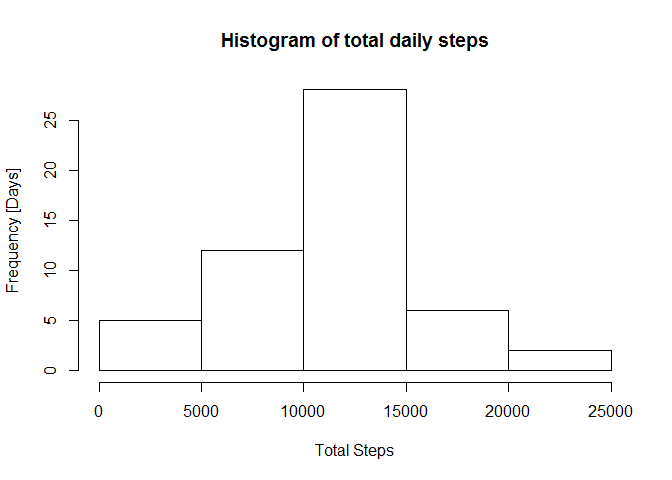
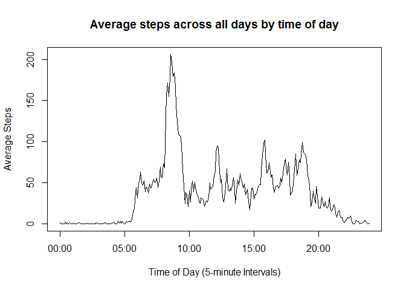
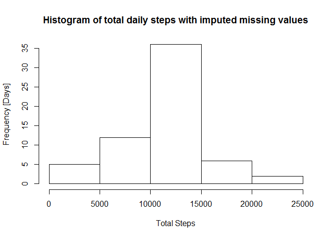
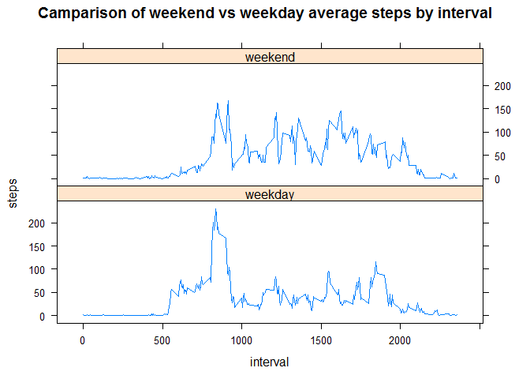

# Reproducible Research: Peer Assessment 1


## Loading and preprocessing the data

```r
activity = read.csv("activity.csv")
```


## What is mean total number of steps taken per day?
1. Calculate the total number of steps taken per day

```r
totalsteps = aggregate(steps~date, data = activity, sum)
```
2. Make a histogram of the total number of steps taken each day

```r
hist(totalsteps$steps, xlab = "Total Steps", ylab = "Frequency [Days]", main="Histogram of total daily steps")
```

 

3. Calculate and report the mean and median of the total number of steps taken per day

```r
mean(totalsteps$steps, na.rm=TRUE)
```

```
## [1] 10766.19
```

```r
median(totalsteps$steps, na.rm=TRUE)
```

```
## [1] 10765
```


## What is the average daily activity pattern?
1. Make a time series plot (i.e. type = "l") of the 5-minute interval (x-axis) and the average number of steps taken, averaged across all days (y-axis).

```r
stepsInterval <- aggregate(steps~interval, data = activity, mean, na.rm = TRUE)

stepsInterval$newIntervals <- strptime(sprintf("%04d", as.numeric(stepsInterval$interval)), format="%H%M")
```


```r
plot(stepsInterval$newIntervals, stepsInterval$steps, type= "l", xlab = "Time of Day (5-minute Intervals)", ylab = "Average Steps", main = "Average steps across all days by time of day")
```

 

2. Which 5-minute interval, on average across all the days in the dataset, contains the maximum number of steps?

```r
stepsInterval$interval[which.max(stepsInterval$steps)]
```

```
## [1] 835
```
## Imputing missing values
1. Calculate and report the total number of missing values in the dataset (i.e. the total number of rows with NAs)


```r
sum(is.na(activity))
```

```
## [1] 2304
```

2. Devise a strategy for filling in all of the missing values in the dataset. The strategy does not need to be sophisticated. For example, you could use the mean/median for that day, or the mean for that 5-minute interval, etc.

I will replace missing values with the mean for that 5-minute interval.

3.Create a new dataset that is equal to the original dataset but with the missing data filled in.


```r
newdf <- activity
for (i in 1:nrow(activity)) {
    if (is.na(activity$steps[i])){
        newdf[i,]$steps <- with(stepsInterval, steps[interval==newdf$interval[i]])
    }
}
```

4. Make a histogram of the total number of steps taken each day and Calculate and report the mean and median total number of steps taken per day. Do these values differ from the estimates from the first part of the assignment? What is the impact of imputing missing data on the estimates of the total daily number of steps?


```r
totalstepsnewdf = aggregate(steps~date, data = newdf, sum)

hist(totalstepsnewdf$steps, xlab = "Total Steps", ylab = "Frequency [Days]", main="Histogram of total daily steps with imputed missing values" )
```

 

```r
mean(totalstepsnewdf$steps)
```

```
## [1] 10766.19
```

```r
median(totalstepsnewdf$steps)
```

```
## [1] 10766.19
```
The impact of imputing missing data with the interval mean is a change to the median, but not the mean (as the mean is simply incremented by values equal to itself. Had the median been used to impute, the median would be the same and the mean would have changed).

## Are there differences in activity patterns between weekdays and weekends?
1. Create a new factor variable in the dataset with two levels - "weekday" and "weekend" indicating whether a given date is a weekday or weekend day.

```r
newdf$date <- as.POSIXlt(newdf$date)
newdf$day <- ifelse(weekdays(newdf$date) %in% c("Saturday", "Sunday"), "weekend", "weekday")    
newdf$day <- as.factor(newdf$day)    
```

2. Make a panel plot containing a time series plot (i.e. type = "l") of the 5-minute interval (x-axis) and the average number of steps taken, averaged across all weekday days or weekend days (y-axis). See the README file in the GitHub repository to see an example of what this plot should look like using simulated data.


```r
library(lattice)
stepsintervalweekend = aggregate(steps~interval + day, data = newdf, mean)
xyplot(steps~interval | day, data = stepsintervalweekend, type = "l", layout = c(1,2), main = "Camparison of weekend vs weekday average steps by time of day")
```

 

